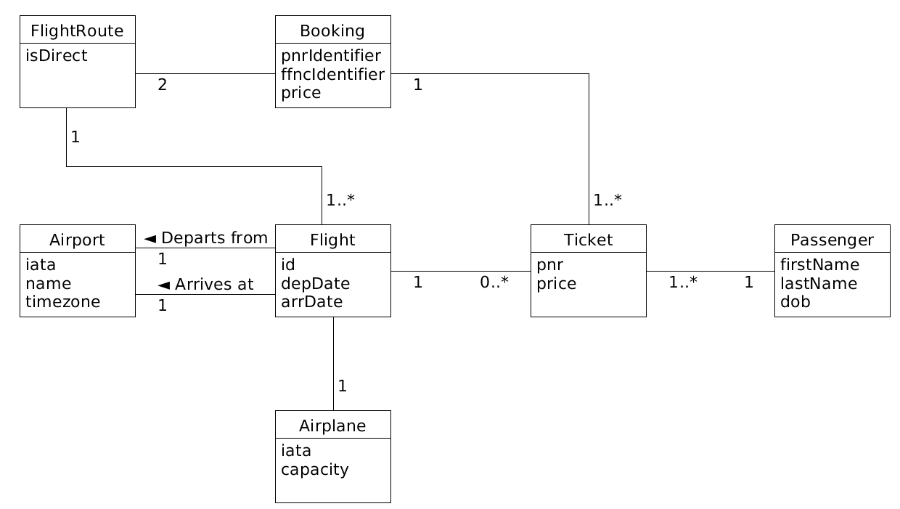
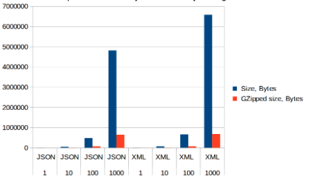

### Abstract

XML is inefficient for transferring data over the network.
The market today puts more value on the transferring speed than ever before. 
By using JSON one can improve the transferring speed by up to 2 times.
IoT and mobile devices would benefit a lot from this.. 


### XML - General Information

XML is one of the most, if not the most, widely spread markup languages. Since its inception, XML has been used as a standard for defining structured documents and data on the Internet. The design goals highlight simplicity, generality and usability. It is a textual data format with support for human languages, however it holds a set of encoding rules which make it both human and machine readable.
The structure of XML object may not seem so human readable at first glance, but essentially it is composed of one or more named elements organized into a tree structure. An element itself is just an opening tag, some data in it and a closing tag which is similar to the HTML structure. A closing tag is the same as an opening one, except it has a slash (/). 

Here is a good example of what XML object looks like:
``` 
 <welcome>Welcome to University</welcome>
```
There is more to a XML object than this and it falls under what we call XML specification. There are Characters, which is essentially every Unicode supported character. Then there we have processor and application.
The processor analyzes the markup and passes structured information to an application.
The specification holds the requirements on what processor must do while the application is outside its scope. The characters which make up XML document are divided into Markup and Content. These two concepts can be distinguished by some simple linguistic rules.
Usually the characters that make up a markup either begin with the character < and end with > or they begin with & and end with ;. XML object also has its own declaration, which 
Describes document and some information about it. 

Example of XML declaration:

```
<?xml version="1.0" encoding="UTF-8"?>
```

XML data processing was simplified with programmers developing APIs, which made it way faster and easily accessible. There are many different applications for XML. There might be a mutual agreement between computer makers about describing information about a computer product(such as processor, graphics card etc.) and then describe the product with XML code.

### JSON - General information

JSON, which stands for JavaScript Object Notation, is a lightweight data format.
It is human-readable and machines have no problems in parsing and generating it.
JSON is based on a subset of JavaScript Programming Language Standard which dates back to 1999. The JSON’s text format is completely independable of any programming languages but people who were exposed to C family languages and other OOP languages will have an easier time because it is using a lot of conventions from those languages. JSON’s structure is pretty simple, it is built on two structures:

1. A collection of key/value pairs
2. An ordered list of   values

These are universal data structures which virtually all modern languages support. 

JSON is taking on these forms:

An object which is an unordered key/value pairs. Objects begin with { and end with }.
Each key is followed by a colon symbol and the objects themselves are seperated with a comma.


### XML vs JSON

One of the main reasons why you wouldn’t choose XML today is because it produces bigger amount of data for the same amount of information.This bloats data transfer, especially when transferring huge amounts of data. This can become a problem for applications with limited bandwidth. It is not uncommon for mobile service providers to limit the amount of cellular bandwidth. Because of this mobile developers must take extra care when transferring data to or from an app. Since most apps are simple in terms of their data model, the advantages of XML do not outweigh the redundancy within the data. 
Another emerging field is IoT - small devices, often running on battery power and have limited network access. Often times these devices are sensors and produce data many times a second, data that needs to be transported. At this rate, JSON still shines over XML, but even then may become too large.

To measure the size of objects serialized with XML and JSON, we set up a simple test. The scenario is a flight ticket rental system, where customers call travel agents to book one or more plane trips. A valid booking contains details about the list of flights to get to a destination and back(in case of a return flight), one ore more tickets and the total price. This is summarized by the model shown below. Bookings used in the test all consist of a departure route with five flights, a return route with two return flights and tickets for each of these flights. Every flight is uses has an airplane and two airports set. The serialized structure is a Java array containing this aggregate.



Code to serialize these aggregate objects was written in Java, using Java 1.8 and two external libraries: `jackson-databind` version `2.10.0.pr1` and `jackson-dataformat-xml` version `2.9.8`, both retrieved from Maven repositories and both belonging to the same family of libraries under the `com.fasterxml.jackson` namespace. Both serializers run using default options, with the exception of the XML having WRITE_XML_DECLARATION feature enabled.
Reducing the number of bytes sent over the internet is not a new issue, because of this the internets protocol, HTTP, has a method to support data compression before transmission. One of the common algorithms for this is called GZip. Because of repetition of tags, XML is a great candidate for compression therefore in the memory benchmark below we included  the size after compression as well. Results of the memory benchmark are summarized in the table below.


Encoding   |   Number of objects   | Size, Bytes | GZipped size, Bytes |
|----------|-----------------------|-------------|---------------------|
| JSON 	| 1 |	4852     	| 978 |
| JSON | 10 | 48275 | 7126 |
| JSON | 100 | 481728 | 66699 |
| JSON | 1000 | 4814048 | 647573 |
| XML  	| 1 |	6677     	|      	1104    	|
| XML  	| 10 |	66003     	|      	7524    	|
| XML  	| 100 |	658486     	|      	69924    	|
| XML             | 1000 | 6581106 | 681338 |

As more clearly seen in the graph below, the serialized size grows quickly with increating the number of objects. No matter, which uncompressed values are compared JSON is significantly smaller with the difference for 1000 objects being 

approximately 1.5 MB. A thousand objects is not uncommon when it comes to application data. As expected, XML achieves a higher level of compression, becoming almost 10 times smaller. While the difference is still there, it is signifanctly smaller: the XML representation is only about 30 kilobytes longer.



The memory benchmark suggests that both formats can achieve similar size after serialization. But it is worth remembering that data needs to be serialized before it can be transmitted, which for applications with tiny amounts of processing power can become an issue, especially if the device also needs to compress that data. Because of this it is worth looking at the time it takes to serialize the same aggregate as before. In this case an array of 10 aggregate objects were used. 

 Encoding | Iterations | Time, seconds | Time with compression, seconds
--- | --- | --- | --- 
| XML  	| 50 000  | 61.773 |  139.562 
| JSON 	| 50 000  | 22.011 | 76.408 

As seen from the table above, XML took almost three times as long to serialize without compression, and twice as long when also using GZip to compress data. 


### Conclussion

This blog compared the transfering speeds between JSON and XML. The results discovered that JSON is a better alternative to XML, because is has transfering speeds which are substantially better. But this doesn’t mean that JSON is a better dataformat than XML. They both have their own use cases, but it is important for one to think about the differences in performance, when one is selecting the which data format to work with.
If one is only looking for the best transmitting speed one should pick JSON over XML.


### References

https://whatis.techtarget.com/definition/XML-Extensible-Markup-Language

https://en.wikipedia.org/wiki/XML

http://www.json.org/

https://stackoverflow.com/questions/4862310/json-and-xml-comparison
